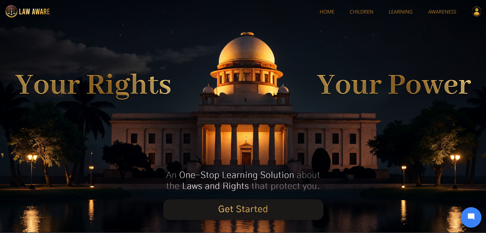
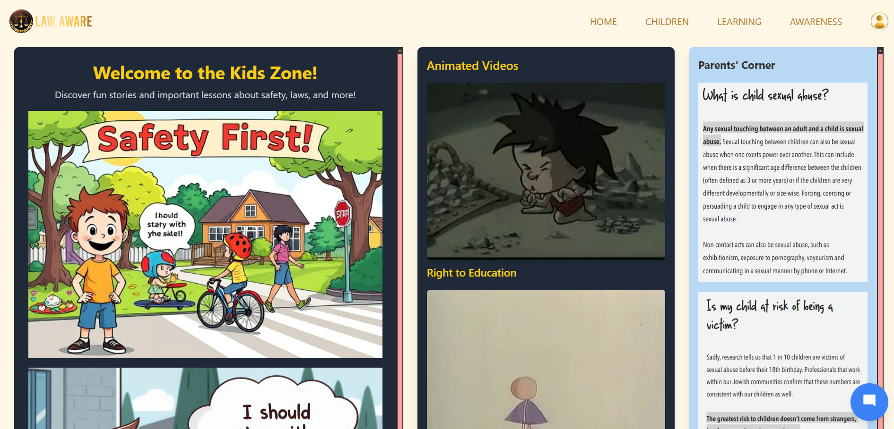
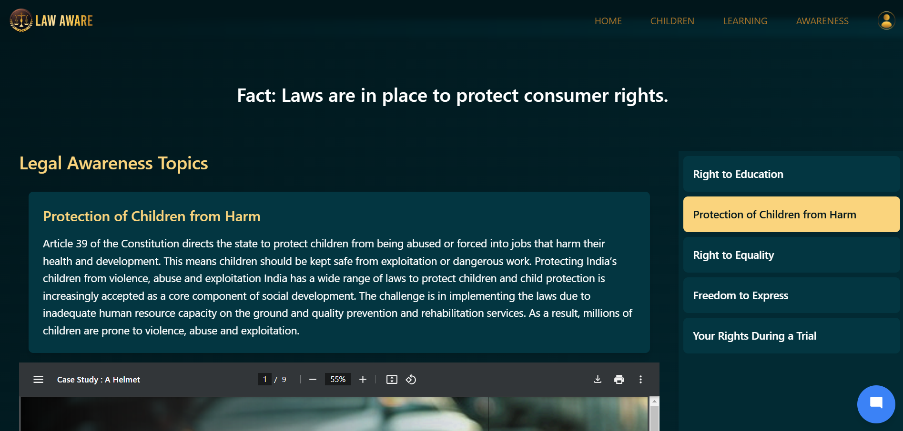
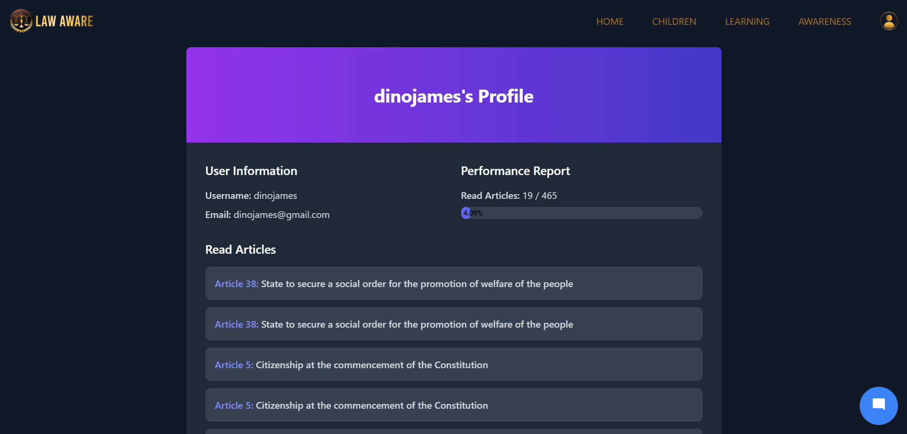

# Welcome to Our Law Aware Website

## Overview

Our law website is dedicated to providing essential resources on legal awareness, children's safety, and the constitution. We aim to empower users with knowledge through various features including a chatbot for immediate assistance, educational articles, news updates, and an interactive forum.

---

## Features

### 🤖 Chatbot
- **Instant Assistance**: Get answers to your legal questions 24/7.
- **User-Friendly Interface**: Easy to navigate and understand.

### 🧒 Children's Safety
- **Basic Guidelines**: Tips and resources for keeping children safe in various environments.
- **Awareness Programs**: Educational content focused on child safety.

### 📚 Learning Resources
- **Articles**: In-depth articles on various legal topics.
- **Constitution**: Access the full text of the constitution with explanations.

### 📰 News Section
- **Latest Updates**: Stay informed with the latest legal news and updates.

### 🌐 Forum
- **Community Interaction**: Engage with others, ask questions, and share knowledge.
- **Expert Insights**: Learn from discussions led by legal professionals.

### 📊 Interesting Facts
- **Legal Trivia**: Fun and interesting facts about laws and rights.

---

## Screenshots

Here are some highlights of our website:

### Children Page

### Awareness Page

### Profile Section

---

## How to Use

1. **Explore Features**: Navigate through the various sections to find resources that interest you.
2. **Interact with the Chatbot**: Ask any legal questions directly through our chatbot.
3. **Join the Forum**: Participate in discussions and gain insights from the community.
4. **Stay Updated**: Regularly check our news section for the latest updates.

---

## Getting Involved

We encourage everyone to participate in our forum and share their experiences. Your contributions can help raise awareness and educate others about legal rights and safety.

---

## Contact Us

If you have any questions or feedback, feel free to reach out:

- **Email**: pranjalsingh.ak@gmail.com
---

Thank you for visiting our law awareness website! Together, we can promote legal literacy and ensure safety for all.
